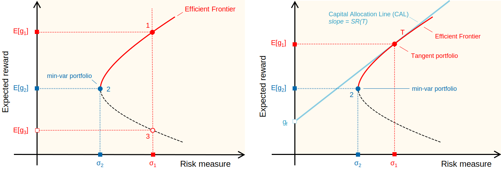

# Session 1: When Optimal Fails, Stress-Testing Classical Minimum-Variance Portfolios

Modern portfolio theory promises an _optimal_ allocation, but optimal under what assumptions? In this session, we build a classical minimum-variance portfolio and then systematically break it: we use AI-driven hybrid Monte Carlo simulation to expose how fragile textbook solutions become when the world doesn't cooperate. The central claim we defend is that *input error*, not optimization error, is the dominant risk in classical mean-variance work, and that the right diagnostic is the *shape* of the stress-test distribution rather than any point estimate of expected return.

__This session is frictionless__: we assume zero transaction costs, infinitely divisible shares, perfect order fills at each day's stated price, no taxes, no slippage, and no borrowing limits beyond the long-only constraint. These assumptions are pedagogical scaffolding, like the frictionless plane in physics. Later session relax all of these assumptions. 

The optimization framework here is classical Markowitz; however, two trained AI models supply the thousands of forward futures that pressure-test the allocation. 
* **regime-switching model** fit to SPY with the Baum-Welch expectation-maximization algorithm learns a small set of latent regime states plus per-state jump-emission distributions and transition probabilities, then samples new trajectories that carry the regime-switching and heavy-tail behavior the training period exhibited. 
* **Student-*t* copula** fit to the historical cross-section captures dependence between tickers that an independent-draws simulation would miss. 

The classical optimizer produces one allocation; probabilistic AI supplies the thousands of futures the scorecard is built from.

> __Learning Objectives:__
>
> By the end of this session, you will be able to:
> * __From Prices to Portfolios:__ Derive the continuously compounded growth rate from price data and assemble the data matrix that feeds the optimizer. Define portfolio reward as the weighted expected growth rate, and portfolio risk as the weighted covariance of growth rates, with explicit conversion between growth-rate and return units.
> * __Optimization and the Sharpe Ratio:__ Formulate the minimum-variance quadratic program with return target, budget, and box constraints. Derive the Capital Allocation Line from the risk-free asset and tangent portfolio, and express the tangent portfolio as the solution to a Sharpe-ratio maximization problem.
> * __Forward Stress Testing and NPV-Based Evaluation:__ Identify three weaknesses of mean-variance optimization: input sensitivity, weight concentration, and assumption fragility. Define the portfolio Net Present Value relative to a risk-free baseline and the tail-risk metrics (VaR, CVaR, max drawdown) that form the baseline scorecard.

Let's get started!
___

## Examples

The example notebooks are split into __core__ examples that we will run live alongside the lecture, and __optional__ examples that extend the core material and can be studied afterward at our own pace.

### Core (tonight)

These notebooks are the lesson's actual deliverables: the calibrated allocation that Session 2 consumes and the tail-risk baseline that Session 2 must beat. We open with a model-risk preflight on the generator that drives every forward stress test in the course; we then complete the [investment questionnaire](interview.md), which generates the `my-tickers.csv` and `portfolio-config.toml` files routing us to the appropriate portfolio-construction notebook.

> __Run live with the lecture:__
>
> * [▶ Let's validate the generative model on a real holdout](eCornell-AI-Finance-S1-Example-Core-OOSGeneratorValidation-May-2026.ipynb). Compare the trained generative market surrogate against real 2025 + 2026 YTD SPY data the model has never seen: marginal moments, Hill's tail index, Anderson-Darling distributional fit, and ACF of $g$ and $|g|$ at lags 1, 5, 10, 20, 50. The notebook surfaces the two named biases on the generator (training-distribution + architectural i.i.d. residual) so we run every downstream stress test on a model whose limits are already disclosed. **Everyone runs this first**, regardless of archetype.
> * [▶ Let's build our minimum-variance portfolio](eCornell-AI-Finance-S1-Example-Core-BuildMinVariancePortfolio-RA-May-2026.ipynb) (fully-invested, risky assets only). Solve the long-only minimum-variance QP at our chosen target growth rate, trace the efficient frontier, and forward-simulate the resulting allocation with the generative model. **Route here from the interview** if our archetype is Balanced, Growth-Oriented, or Aggressive Growth.
> * [▶ Let's build our minimum-variance portfolio with a cash sleeve](eCornell-AI-Finance-S1-Example-Core-MinVariancePortfolio-RRFA-May-2026.ipynb) (risky + risk-free assets). Compute the tangent (maximum-Sharpe) portfolio via SOCP, construct the Capital Allocation Line, and forward-simulate a $\theta$-blended allocation. **Route here from the interview** if our archetype is Conservative Income or Conservative Growth.
> * [▶ Let's stress-test the minimum-variance portfolio](eCornell-AI-Finance-S1-Example-Core-StressTestMinVariancePortfolio-May-2026.ipynb). Generate many synthetic futures via the SIM with generative residuals, run buy-and-hold across four portfolios (min-var, equal-weight 1/N, the market index, and a continuously compounded risk-free baseline), and produce a tail-risk scorecard featuring VaR, CVaR with sampling standard error, max drawdown, and portfolio NPV against the risk-free baseline. Produces the `stress-test-baseline.jld2` handoff that the Session 2 rebalancing engine must beat.
>

Once we complete the core examples, we will have a calibrated minimum-variance portfolio and a forward-simulated tail-risk baseline. In Session 2, we'll implement a rebalancing strategy that tries to beat this baseline on the same metrics.

### Optional (self-study)

These two notebooks extend the lesson: one motivates the generative model (the stylized facts that a plain Gaussian model cannot reproduce), and the other shows how to compute the single index parameters (SIM) parameters we rely on were fit in the first place. 

> __Extension material (self-study):__
>
> * [▶ Let's explore the stylized facts of log growth rate data](eCornell-AI-Finance-S1-Example-Optional-StylizedFacts-May-2026.ipynb). Compute growth rates from the synthetic training dataset, test for fat tails via Anderson-Darling and Hill's estimator, and verify volatility clustering via autocorrelation of absolute returns. This is the empirical motivation for the generative SIM + generative model + Student-$t$ copula construction that the stress test uses; the core examples just consume the generator, this one shows why the generator has the shape it does.
> * [▶ Let's estimate SIM parameters with bootstrap uncertainty quantification](eCornell-AI-Finance-S1-Example-Optional-SIMParameterEstimation-May-2026.ipynb). Estimate Single Index Model parameters from the synthetic training dataset via regularized OLS, bootstrap the sampling distribution for a demonstration ticker, and run batch estimation across all 424 tickers. The results are already cached as `sim-parameter-estimates.jld2` and loaded by the core examples; this notebook shows the estimation procedure if we want to re-fit on a different universe or a different training window.
>
> Study either when we want to understand where the core examples' cached inputs come from.

___

## From Prices to Growth Rates
The inputs to portfolio optimization, expected growth rates and covariances, must be _estimated_ from observed price data, starting with the __Continuously Compounded Growth Rate (CCGR)__, which converts a time series of asset prices into a stationary series of growth rates suitable for statistical analysis:

>  __Continuously Compounded Growth Rate (CCGR)__
>
> Let's assume a model of the share price of firm $i$ is governed by an expression of the form:
>$$
\begin{align*}
S^{(i)}_{j} &= S^{(i)}_{j-1}\;\exp\left(\underbrace{g^{(i)}_{j,j-1}\Delta{t}_{j}}_{\text{return}}\right)
\end{align*}
> $$
> where $S^{(i)}_{j-1}$ denotes the share price of firm $i$ at time index $j-1$, $S^{(i)}_{j}$ denotes the share price of firm $i$ at time index $j$, and $\Delta{t}_{j} = t_{j} - t_{j-1}$ denotes the length of a time step (units: years) between time index $j-1$ and $j$. The value we are going to estimate from data is the growth rate $g^{(i)}_{j,j-1}$ (units: inverse years) for each firm $i$. Let's rearrange the continuous share price expression to solve for $g^{(i)}_{j,j-1}$:
> $$\begin{align*}
S^{(i)}_{j} & = S^{(i)}_{j-1}\;\exp\left(g^{(i)}_{j,j-1}\Delta{t}_{j}\right) \\
S^{(i)}_{j}/S^{(i)}_{j-1} & = \exp\left(g^{(i)}_{j,j-1}\Delta{t}_{j}\right) \\
\ln\left(S^{(i)}_{j}/S^{(i)}_{j-1}\right) & = g^{(i)}_{j,j-1}\Delta{t}_{j} \\
g^{(i)}_{j,j-1} & = \left(\frac{1}{\Delta{t}_{j}}\right)\,\ln\left(\frac{S^{(i)}_{j}}{S^{(i)}_{j-1}}\right)\quad\blacksquare
\end{align*}
> $$

We have a generative model that generates per-period growth rates $g^{(i)}_{j,j-1}$ for ticker $i$; log growth rates are additive over time and approximate simple percentage returns for small values. 

Growth rate distributions $\left\{g^{(i)}_{j,j-1}\right\}_{j=1}^{T}$ have some interesting statistical properties (stylized facts) worth exploring: __Heavy (fat) tailed distribution__: Extreme price movements are more likely than a Normal distribution predicts; __Absence of Autocorrelation__: Returns are approximately uncorrelated, consistent with a random walk with occasional jumps; __Volatility clustering__: Large price movements tend to be followed by other large moves, and small moves follow small moves.

> __Example__
>
> Does our generative model capture these stylized facts? We will check in the core example, but if we want to explore the stylized facts of growth rate data in more depth, check out the optional notebook on stylized facts.
>
> * [▶ Let's validate the generative model on a real holdout](eCornell-AI-Finance-S1-Example-Core-OOSGeneratorValidation-May-2026.ipynb): the verification step on the generator. Position real 2025 + 2026 YTD SPY moments, tail index, distributional fit, and ACF of $g$ and $|g|$ inside the synthetic envelope across many model draws, and surface the two named biases (training-distribution + architectural i.i.d. residual) before we run a single stress test on top of the generator's output.
> * [▶ Let's explore the stylized facts of log growth rate data (optional)](eCornell-AI-Finance-S1-Example-Optional-StylizedFacts-May-2026.ipynb). We compute growth rates from the synthetic training dataset, test for fat tails via Anderson-Darling and Hill's estimator, and verify volatility clustering via autocorrelation of absolute returns. 

For a deeper dive into the stylized facts of growth rate data: [check out optional the stylized facts deeper dive notebook](eCornell-AI-Finance-S1-DeeperDive-StylizedFacts-May-2026.ipynb). 
___

## Notation

Before we move from price observations to portfolio optimization, we collect the symbols used through the rest of this lecture and inherited by Sessions 2-4. Several of them appear without re-definition in the [Modern Portfolio Theory (MPT)](#modern-portfolio-theory-mpt), [Capital Allocation Line](#the-capital-allocation-line-and-tangent-portfolio), and [When Optimal Fails](#when-optimal-fails-weaknesses-of-mean-variance-optimization) sections; this is the one place we define them.

> __Notation:__
>
> * $\mathbb{R}$: the real line. $\mathbb{R}^N$: the $N$-dimensional real Euclidean space. $\mathbb{R}_{\geq 0}$: the non-negative reals $\{x \in \mathbb{R} : x \geq 0\}$.
> * Bold lowercase ($\mathbf{w}, \mathbf{g}$) denotes vectors, bold uppercase ($\boldsymbol{\Sigma}, \mathbf{X}$) denotes matrices, non-bold ($w_i, g_i$) denotes scalars.
> * $S_i(t)$: share price of firm $i$ at clock time $t$ (continuous-time view); equivalent to $S^{(i)}_j$ at the discrete observation index $j$ where $t = t_j$. Sessions 2-4 use the $S_i(t)$ form throughout.
> * $\sigma_i = \sqrt{\mathrm{Var}(g_i)}$: standard deviation (volatility) of asset $i$'s growth rate, in units of $1/\sqrt{\text{yr}}$.
> * $\sigma_m$: standard deviation of the market growth rate $g_{\mathrm{mkt}}$.
> * $\rho_{ij} = \mathrm{Cov}(g_i, g_j) / (\sigma_i \sigma_j)$: Pearson correlation between asset $i$ and asset $j$ growth rates, with $\rho_{ij} \in [-1, 1]$.
> * $\varepsilon_i$ and $\sigma_{\varepsilon,i}$: Single Index Model residual for asset $i$ and its standard deviation. The SIM is $g_i = \alpha_i + \beta_i \, g_{\mathrm{mkt}} + \varepsilon_i$ with $\mathbb{E}[\varepsilon_i] = 0$ and $\mathrm{Var}(\varepsilon_i) = \sigma_{\varepsilon,i}^{\,2}$; $\alpha_i$ and $\beta_i$ are formally introduced in [§ Capital Allocation Line and Tangent Portfolio](#the-capital-allocation-line-and-tangent-portfolio).

___

    

        
    

**Figure 1:** Schematic of the minimum-variance frontier with a risky only (left) and risky and risk-free asset (right). __Left__: The curved red line is the risky-only efficient frontier. Every point on this line represents a portfolio with a different level of risk and reward. __Right__: the straight blue line from $(0, g_f)$ through the tangent point is the Capital Allocation Line (CAL); the tangent portfolio is the single risky allocation that maximizes the Sharpe ratio (slope of the CAL). The blended $\theta$-allocation is a point on the CAL that mixes the risk-free asset and the tangent portfolio.

## Modern Portfolio Theory (MPT)
In 1952, [Harry Markowitz](https://doi.org/10.2307/2975974) proposed a deceptively simple idea: investors care about the _expected return_ and the _variance_ (risk) of their portfolio. Investors want the minimum risk for a given level of expected return.

__MPT optimally balances risk and reward__ by diversifying investments across different assets. Moving to the right along the frontier increases both reward and risk, and the curvature of the frontier encodes the _cost of chasing return_: initially, a small increase in risk buys a lot of extra return, but the marginal benefit diminishes as we move further right.

### Portfolio Reward
The reward of a portfolio is measured by its expected growth (return), which is the weighted sum of the expected growth rates (returns) of the individual assets in the portfolio weighted by the fraction of the total portfolio value invested in each asset. 

Suppose we have a portfolio $\mathcal{P}$ consisting of $N$ assets. Let $w_i\in\mathbb{R}_{\geq 0}$ be the weight of asset $i$ in the portfolio (i.e., the dollar fraction of the total portfolio value invested in asset $i$), and let $\mathbb{E}[g_i]$ be the expected growth rate (scaled return) of asset $i$. Then, the expected growth rate (return) of the portfolio, denoted as $\mathbb{E}[g_{\mathcal{P}}]$, is given by:
$$
\mathbb{E}[g_{\mathcal{P}}] = \sum_{i=1}^{N} w_i \mathbb{E}[g_i]\quad\Longrightarrow\;\mathbf{w}^{\top}\mathbb{E}[\mathbf{g}]
$$
where $N$ is the total number of assets in the portfolio, i.e., $|\mathcal{P}| = N$, the weight vector is $\mathbf{w}^{\top} = [w_1, w_2, \dots, w_N]$, the sum of weights is one, and $\mathbb{E}[\mathbf{g}] = [\mathbb{E}[g_1], \mathbb{E}[g_2], \dots, \mathbb{E}[g_N]]^{\top}$ is the vector of expected growth rates (returns) of the individual assets.

> __Growth Rate versus Return?__  
>
> We use a somewhat strange convention of measuring reward in terms of the expected growth rate $\mathbb{E}[g_i]$ of asset $i$ instead of the more typical expected return $\mathbb{E}[r_i]$. However, regardless of this choice, the reward argument remains the same (it's just scaled by the inverse time step between the two perspectives). 
> 
> Let $g_{\star} = r_{\star}/\Delta{t}$. Then, the expected return of the portfolio is given by:
> $$
\begin{align*}
\mathbb{E}[g_{\mathcal{P}}] & = \sum_{i=1}^{N} w_i\,\mathbb{E}[g_i]\\
& = \sum_{i=1}^{N} w_i\,\mathbb{E}\Bigl[\frac{r_i}{\Delta{t}}\Bigr]\quad\Longrightarrow\text{pull out } \left(\frac{1}{\Delta{t}}\right)\text{ from the sum} \\
& = \left(\frac{1}{\Delta{t}}\right)\,\sum_{i=1}^{N} w_i\,\mathbb{E}[r_i]\\
& = \left(\frac{1}{\Delta{t}}\right)\mathbf{w}^{\top}\mathbb{E}[\mathbf{r}]\quad\blacksquare    
\end{align*}$$
> The expected return $\mathbf{w}^{\top}\mathbb{E}[\mathbf{r}]$ is __dimensionless__, while the expected growth rate of the portfolio has units of $[\text{time}]^{-1}$. We can convert between the two by multiplying or dividing by the time step $\Delta{t}$.

### Portfolio Risk
The risk of a portfolio is (typically) measured by its variance (or standard deviation) of growth rates (returns), which takes into account the variances of the individual assets as well as the covariances between them. The portfolio variance written in terms of growth rates is given by:
$$
\text{Var}(g_{\mathcal{P}}) = \sum_{i=1}^{N} \sum_{j=1}^{N} w_i w_j \text{Cov}(g_i, g_j)\quad\Longrightarrow\;\mathbf{w}^{\top}\boldsymbol{\Sigma}_{g}\mathbf{w}
$$
where $\text{Cov}(g_i, g_j)$ is the covariance between the growth rates of assets $i$ and $j$, and $\boldsymbol{\Sigma}_{g}$ is the covariance matrix of asset growth rates, defined as:
$$
\boldsymbol{\Sigma}_{g} =
\begin{bmatrix}
\text{Var}(g_1) & \text{Cov}(g_1, g_2) & \cdots & \text{Cov}(g_1, g_N) \\
\text{Cov}(g_2, g_1) & \text{Var}(g_2) & \cdots & \text{Cov}(g_2, g_N) \\
\vdots & \vdots & \ddots & \vdots \\
\text{Cov}(g_N, g_1) & \text{Cov}(g_N, g_2) & \cdots & \text{Var}(g_N)
\end{bmatrix}
$$

However, we could also write the portfolio risk with respect to the returns instead of the growth rates, i.e., $\text{Cov}(r_i, r_j)$ and $\text{Var}(r_{\mathcal{P}})$.

> __Covariance of Growth Rates versus Returns__  
> 
> The portfolio risk argument remains the same. Let $g_{\star} = r_{\star}/\Delta{t}$. Then, the variance of the portfolio of $N$ assets is given by:
> $$
\begin{align*}
\text{Var}(g_{\mathcal{P}}) & = \sum_{i=1}^{N} \sum_{j=1}^{N} w_i w_j \text{Cov}(g_i, g_j)\\
& = \sum_{i=1}^{N} \sum_{j=1}^{N} w_i w_j \text{Cov}\Bigl(\frac{r_i}{\Delta{t}}, \frac{r_j}{\Delta{t}}\Bigr)\quad\Longrightarrow\text{pull out } \frac{1}{(\Delta{t})^2} \\
& = \frac{1}{(\Delta{t})^2} \sum_{i=1}^{N} \sum_{j=1}^{N} w_i w_j \text{Cov}(r_i, r_j)\\
& = \left(\frac{1}{(\Delta{t})^2}\right)\mathbf{w}^{\top}\boldsymbol{\Sigma}_{r}\mathbf{w}\quad\blacksquare    
\end{align*}$$
> where $\boldsymbol{\Sigma}_{r}$ is the covariance matrix of asset returns. The portfolio variance $\mathbf{w}^{\top}\boldsymbol{\Sigma}_{r}\mathbf{w}$ is __dimensionless__, while the portfolio variance of growth rates has units of $[\text{time}]^{-2}$. We can convert between the two by multiplying or dividing by $(\Delta{t})^2$. 

There are **two different covariance inputs** we can feed the optimizer, and they carry different units:

* __Return covariance $\boldsymbol{\Sigma}_r$ matrix__ (per-step, dimensionless): what we get from the sample covariance of daily log returns. Annualizing requires the practitioner $\times\,N_{\text{steps}}$ rule. If $\boldsymbol{\Sigma}_r$ is daily, then the **annualized return variance** of the portfolio is given by:
    $$
    \boxed{
    \text{Var}_{\text{annualized}}(r_{\mathcal{P}}) \;=\; \left(\frac{1}{\Delta{t}}\right)\mathbf{w}^{\top}\boldsymbol{\Sigma}_{r}\mathbf{w}\quad\blacksquare
    }
    $$
    The practitioner *volatility in %/yr* is $\sqrt{\text{Var}_{\text{annualized}}(r_{\mathcal{P}})} \cdot 100$.

* __Growth-rate covariance $\boldsymbol{\Sigma}_g$ matrix__ (already in units of 1/year²): what we get from the Single Index Model construction in [single index model covariance derivation notebook](deeper/eCornell-AI-Finance-S1-Derivation-SIM-Covariance-May-2026.ipynb). The per-element SIM formula is
$\boldsymbol{\Sigma}_{g,\,ij} = \beta_i \beta_j \sigma_m^2$ off-diagonal and $\beta_i^2 \sigma_m^2 + \Delta t\,\sigma^2_{\varepsilon_i}$ on the diagonal, where the $\Delta t$ factor is a parameterization choice for $\sigma^2_{\varepsilon_i}$ so that the diagonal carries the correct per-step residual variance. $\mathbf{w}^\top \boldsymbol{\Sigma}_g \mathbf{w}$ is then already the per-year growth-rate variance; **no additional annualization factor needed**. The practitioner volatility in %/yr is then:
    $$
    \boxed{
    \sigma_{\mathcal{P}}^{\text{finance}} \;=\; \frac{\sqrt{\mathbf{w}^\top \boldsymbol{\Sigma}_g \mathbf{w}}}{\sqrt{N_{\text{steps}}}}\cdot 100\quad\blacksquare
    }
    $$
    i.e., divide the rate-variance std-dev by $\sqrt{252}$ to convert from 1/year-based vol to the practitioner *%/yr* convention.

Ok, we have our risk and reward measures for a portfolio of $N$ assets. Now, let's see how we can use this information to construct an optimal portfolio that balances these two forces.

### Optimal Weights for a Risky Portfolio
The goal of MPT is to find the optimal weights $\mathbf{w}$ that minimize the portfolio risk for a given level of expected return, or equivalently, maximize the expected return for a given level of risk. This is typically done by solving a __constrained quadratic programming__ problem that has a unique global minimum and can be solved efficiently using solvers such as [Ipopt](https://coin-or.github.io/Ipopt/) or [COSMO](https://github.com/oxfordcontrol/COSMO.jl). 

Let's consider the case when we have a portfolio $\mathcal{P}$ consisting of $N$ __risky assets__, i.e., only equity, ETFs (or potentially derivatives) but no fixed income assets. In this case, we can formulate the optimal weights optimization problem (written in terms of growth rate) as:
$$
\boxed{
\begin{align*}
\text{minimize}~\text{Var}(g_{\mathcal{P}}) &= \sum_{i\in\mathcal{P}}\sum_{j\in\mathcal{P}}w_{i}w_{j}\underbrace{\text{Cov}\left(g_{i},g_{j}\right)}_{= \sigma_{i}\sigma_{j}\rho_{ij}}\quad{\Longleftrightarrow\mathbf{w}^\top \boldsymbol{\Sigma}_{g} \mathbf{w}} \\
\text{subject to}~\mathbb{E}[g_{\mathcal{P}}]& =  \sum_{i\in\mathcal{P}}w_{i}\;\mathbb{E}[g_{i}] = R^{*}\quad\Longleftrightarrow\mathbf{w}^\top \mathbb{E}[\mathbf{g}] = R^{*} \\
\sum_{i\in\mathcal{P}}w_{i} & =  1 \\
l_{i} & \leq w_{i} \leq u_{i} \quad \forall\, i\in\mathcal{P}
\end{align*}}
$$
The objective $\mathbf{w}^{\top}\boldsymbol{\Sigma}_{g}\,\mathbf{w}$ is the portfolio variance (risk). The first constraint sets the target growth rate at $R^{*}$. The budget constraint forces the weights to sum to 1 (fully invested). The box constraints enforce position limits.

The boxed program has three pieces that come from policy, not from the optimizer: the target growth rate $R^{*}$, the per-asset box bounds $l_i, u_i$, and the budget constraint $\sum_i w_i = 1$. Sweeping $R^{*}$ over a grid and re-solving the QP at each value is what traces the entire efficient frontier; the box bounds and budget constraint are held fixed across the sweep.

### Algorithm: Efficient Frontier Construction (QP Sweep)

__Initialize__: Given a portfolio $\mathcal{P}$ of $N$ risky assets with expected growth-rate vector $\mathbb{E}[\mathbf{g}] \in \mathbb{R}^{N}$ and growth-rate covariance matrix $\boldsymbol{\Sigma}_{g} \in \mathbb{R}^{N \times N}$, per-asset box bounds $(l_i, u_i)$ for $i = 1, \ldots, N$ (e.g., $l_i = 0$ for long-only, $u_i = u$ for a uniform concentration cap), a budget constraint $\sum_{i} w_i = 1$, and a target-return grid $\mathcal{R}^{\star} = \{R^{\star}_{1}, R^{\star}_{2}, \ldots, R^{\star}_{M}\}$ spanning the feasible interval $[g_{\min}, g_{\max}]$, initialize an empty frontier $\mathcal{F} \gets \varnothing$ and an empty infeasible set $\mathcal{I} \gets \varnothing$.

For $k = 1, \ldots, M$ __do__:

1. Solve the quadratic program at target growth rate $R^{\star}_{k}$:
    $$\mathbf{w}^{\star}_{k} \gets \arg\min_{\mathbf{w} \in \mathbb{R}^{N}}\;\mathbf{w}^{\top}\boldsymbol{\Sigma}_{g}\mathbf{w}\quad\text{s.t.}\quad\mathbf{w}^{\top}\mathbb{E}[\mathbf{g}] = R^{\star}_{k},\;\sum_{i}w_{i} = 1,\;l_{i} \leq w_{i} \leq u_{i}\;\forall\,i.$$
2. If the QP is feasible, compute the portfolio growth-rate variance $\sigma^{2}_{k} \gets (\mathbf{w}^{\star}_{k})^{\top}\boldsymbol{\Sigma}_{g}\mathbf{w}^{\star}_{k}$ and append the frontier point: $\mathcal{F} \gets \mathcal{F} \cup \{(\sigma_{k}, R^{\star}_{k}, \mathbf{w}^{\star}_{k})\}$.
3. Otherwise, mark the target as infeasible: $\mathcal{I} \gets \mathcal{I} \cup \{R^{\star}_{k}\}$ (no portfolio in the box hits this growth rate).

__Output__: Return the efficient frontier $\mathcal{F} = \{(\sigma_{k}, R^{\star}_{k}, \mathbf{w}^{\star}_{k})\}$, the infeasible target set $\mathcal{I}$, and the global minimum-variance portfolio $(\sigma^{\star}, R^{\star}, \mathbf{w}^{\star}) = \arg\min_{(\sigma_{k}, \cdot, \cdot) \in \mathcal{F}} \sigma_{k}$.

In our implementation, $R^{\star}$ is the `target_growth` field of `portfolio-config.toml` (Step 8 of the ticker interview), the box bounds $(l_i, u_i)$ are $0$ and `max_weight` (Step 6), and the CAL's risk-free fraction $w_f$ equals `cash_fraction` (Step 12); changing these three numbers in the TOML propagates to every notebook in Sessions 1-4.

Let's work through an example.

> __Example__
> 
> [▶ Let's build our minimum-variance portfolio](eCornell-AI-Finance-S1-Example-Core-BuildMinVariancePortfolio-RA-May-2026.ipynb). Let's build a classical minimum-variance portfolio from synthetic data. We generate a synthetic asset universe, estimate the growth rates and the covariance matrix, solve the quadratic program, compute the efficient frontier, and explore input sensitivity. We'll let AI select the tickers using a survey.
___

### The Capital Allocation Line and Tangent Portfolio

When we introduce a risk-free asset into our portfolio optimization problem, the efficient frontier transforms into a straight line in risk-return space. This line is called the __Capital Allocation Line (CAL)__.

The Capital Allocation Line describes all portfolios that can be formed by combining a risk-free asset (e.g., Treasury STRIPS) with return $g_f$ and zero variance, and a single optimal risky portfolio called the __tangent portfolio__ (denoted by $T$). The tangent portfolio has expected return $\mathbb{E}[g_T]$ and variance $\sigma_T^2$. Any portfolio on the CAL can be expressed as:
$$
\begin{align*}
\mathbb{E}[g_{\mathcal{P}}] &= w_f g_f + (1 - w_f)\;\mathbb{E}[g_T]\\
\sigma_{\mathcal{P}} &= (1 - w_f) \sigma_T
\end{align*}
$$
where $w_f$ is the fraction invested in the risk-free asset, $(1-w_f)$ is the fraction invested in the tangent portfolio, $\sigma_{\mathcal{P}} = \sqrt{\operatorname{Var}(g_{\mathcal{P}})}$ is the standard deviation of the portfolio return, and $\sigma_T = \sqrt{\operatorname{Var}(g_T)}$ is the standard deviation of the tangent portfolio return. To derive the CAL equation, we solve for $w_f$ from the second equation and substitute into the first:
$$
\begin{align*}
\sigma_{\mathcal{P}} &= (1 - w_f) \sigma_T\\
\frac{\sigma_{\mathcal{P}}}{\sigma_T} &= 1 - w_f\\
w_f &= 1 - \frac{\sigma_{\mathcal{P}}}{\sigma_T}
\end{align*}
$$
Substituting this expression for $w_f$ into the expected return equation:
$$
\begin{align*}
\mathbb{E}[g_{\mathcal{P}}] &= w_f g_f + (1 - w_f) \mathbb{E}[g_T]\\
&= \left(1 - \frac{\sigma_{\mathcal{P}}}{\sigma_T}\right) g_f + \frac{\sigma_{\mathcal{P}}}{\sigma_T} \mathbb{E}[g_T]\\
&= g_f - \frac{\sigma_{\mathcal{P}}}{\sigma_T} g_f + \frac{\sigma_{\mathcal{P}}}{\sigma_T} \mathbb{E}[g_T]\\
&= g_f + \frac{\sigma_{\mathcal{P}}}{\sigma_T} \left(\mathbb{E}[g_T] - g_f\right)\\
&= g_f + \underbrace{\left(\frac{\mathbb{E}[g_T] - g_f}{\sigma_T}\right)}_{\text{Sharpe ratio T.P.}}\;\sigma_{\mathcal{P}}\quad\blacksquare
\end{align*}
$$
This is a __linear relationship__ between expected return and risk. The slope of this line is the __Sharpe ratio of the tangent portfolio__, which measures the excess return per unit of risk for that optimal risky portfolio.

To find the tangent portfolio, we identify the risky portfolio that maximizes the Sharpe ratio. Geometrically, it's the point where a line from the risk-free rate is tangent to the risky-only efficient frontier. Using the single index model, where $g_{\mathrm{mkt}}$ denotes the market growth rate, we solve the optimization problem for the weights $w_i$ of the risky assets in portfolio $\mathcal{P}$ that maximizes the Sharpe ratio:
$$
\boxed{
\begin{align*}
\text{maximize} &\quad \frac{\mathbb{E}[g_{\mathcal{P}}] - g_f}{\sigma_{\mathcal{P}}} = \frac{\alpha_{\mathcal{P}} + \beta_{\mathcal{P}}\;\mathbb{E}[g_{\mathrm{mkt}}] - g_f}{\sigma_{\mathcal{P}}}\\
\text{subject to} &\quad \sum_{i\in\mathcal{P}}w_{i} = 1\\
&\quad w_{i} \geq 0 \qquad \forall{i}\in\mathcal{P}
\end{align*}}
$$
where $\alpha_{\mathcal{P}} = \sum_{i\in\mathcal{P}} w_i\,\alpha_i$ and $\beta_{\mathcal{P}} = \sum_{i\in\mathcal{P}} w_i\,\beta_i$ are the portfolio-level SIM coefficients, inherited by linearity from the per-asset $\alpha_i, \beta_i$ derived in the single index model. The portfolio $\mathcal{P}$ that solves this optimization problem is the tangent portfolio $T$. Once found, its Sharpe ratio $\left(\mathbb{E}[g_T] - g_f\right)/{\sigma_T}$ becomes the slope of the CAL.

The Sharpe-max objective is a ratio of two functions of $\mathbf{w}$ (with a quadratic in the denominator), so it is not a standard QP. The standard approach is to lift the problem into a Second-Order Cone Program (SOCP) by introducing a normalization scalar $\tau > 0$ and a lifted variable $\mathbf{y} = \tau\mathbf{w}$ that fixes the excess-growth numerator to one; the tangent point then comes out of a single convex solve. We package this as the next algorithm.

### Algorithm: Tangent Portfolio via SOCP (Sharpe Maximization)

__Initialize__: Given a portfolio $\mathcal{P}$ of $N$ risky assets with per-asset SIM parameters $\{(\alpha_i, \beta_i, \sigma_{\varepsilon,i})\}_{i=1}^{N}$ and market growth statistics $(\mathbb{E}[g_{\mathrm{mkt}}], \sigma_m^{2})$, assemble the expected excess-growth vector $\mathbf{c} = \boldsymbol{\alpha} + \boldsymbol{\beta}\,\mathbb{E}[g_{\mathrm{mkt}}] - g_f\,\mathbf{1} \in \mathbb{R}^{N}$ and the SIM growth-rate covariance $\boldsymbol{\Sigma}_{g} = \sigma_m^{2}\,\boldsymbol{\beta}\boldsymbol{\beta}^{\top} + \Delta t\,\mathrm{diag}(\sigma_{\varepsilon,i}^{2})$. Compute the Cholesky factor $\mathbf{U}$ with $\boldsymbol{\Sigma}_{g} = \mathbf{U}^{\top}\mathbf{U}$ so that $\sigma_{\mathcal{P}} = \|\mathbf{U}\mathbf{w}\|_{2}$. Set the long-only box bounds $0 \leq w_{i}$ (with optional concentration cap $w_{i} \leq u$) and introduce a normalization scalar $\tau > 0$ together with the lifted variable $\mathbf{y} = \tau\mathbf{w} \in \mathbb{R}^{N}$.

Solve:

1. Solve the SOCP normalized for the excess-growth numerator:
    $$\mathbf{y}^{\star},\,\tau^{\star} \gets \arg\min_{\mathbf{y} \in \mathbb{R}^{N},\;\tau > 0}\;\|\mathbf{U}\mathbf{y}\|_{2}\quad\text{s.t.}\quad\mathbf{c}^{\top}\mathbf{y} = 1,\;\sum_{i} y_{i} = \tau,\;y_{i} \geq 0\;\forall\,i.$$
2. Recover the tangent weights: $\mathbf{w}_{T} \gets \mathbf{y}^{\star}/\tau^{\star}$.
3. Compute the tangent statistics from the SIM coefficients:
    $$\alpha_{T} \gets \mathbf{w}_{T}^{\top}\boldsymbol{\alpha},\quad \beta_{T} \gets \mathbf{w}_{T}^{\top}\boldsymbol{\beta},\quad \mathbb{E}[g_{T}] \gets \alpha_{T} + \beta_{T}\,\mathbb{E}[g_{\mathrm{mkt}}],\quad \sigma_{T} \gets \sqrt{\mathbf{w}_{T}^{\top}\boldsymbol{\Sigma}_{g}\mathbf{w}_{T}},\quad \mathrm{SR}(T) \gets \frac{\mathbb{E}[g_{T}] - g_{f}}{\sigma_{T}}.$$
4. Build the CAL: for any cash fraction $w_{f} \in [0, 1]$, the blended portfolio is $(\sigma_{\mathcal{P}}, \mathbb{E}[g_{\mathcal{P}}]) = ((1 - w_{f})\sigma_{T},\; w_{f}\,g_{f} + (1 - w_{f})\,\mathbb{E}[g_{T}])$, and the CAL slope equals $\mathrm{SR}(T)$.

__Output__: Return the tangent weights $\mathbf{w}_{T}$, the tangent statistics $(\alpha_{T}, \beta_{T}, \mathbb{E}[g_{T}], \sigma_{T}, \mathrm{SR}(T))$, and the CAL parameterization $(g_{f}, \mathrm{SR}(T))$ that lets us read off any $\theta$-blended portfolio on the line.

Two practical caveats sit alongside the algorithm. First, **concentration constraints**: without a cap, unconstrained tangent-portfolio optimization often produces extreme weights in a few assets, especially with imprecise estimates; a cap $w_{i} \leq u$ (the `max_weight` from interview Step 6) trades a small amount of in-sample Sharpe for materially better out-of-sample robustness to estimation error. Second, **solver choice**: in our implementation the SOCP is solved with [COSMO.jl](https://github.com/oxfordcontrol/COSMO.jl) (or [Clarabel.jl](https://github.com/oxfordcontrol/Clarabel.jl)), $g_{f}$ is the configured risk-free growth rate, and the cash fraction $w_{f}$ on the CAL maps directly to the `cash_fraction` field of `portfolio-config.toml` (interview Step 12).

#### The Sharpe ratio in general

For any risky portfolio $\mathcal{P}$ with expected growth $\mathbb{E}[g_{\mathcal{P}}]$ and growth-rate volatility $\sigma_{\mathcal{P}}$, the **Sharpe ratio** is given by:
$$\boxed{\mathrm{SR}(\mathcal{P}) = \frac{\mathbb{E}[g_{\mathcal{P}}] - g_f}{\sigma_{\mathcal{P}}}\quad\blacksquare}$$
This is a dimensionless measure of risk-adjusted excess growth that lets us compare portfolios with different risk profiles. The tangent portfolio $T$ is by construction the risky portfolio that maximizes $\mathrm{SR}(\mathcal{P})$, so the algorithm above returns the portfolio at the top of this ranking.

Let's look at an example that demonstrates constructing the Capital Allocation Line and finding the tangent portfolio.

> __Example__
> 
> [▶ Let's build our minimum-variance portfolio with a cash sleeve](eCornell-AI-Finance-S1-Example-Core-MinVariancePortfolio-RRFA-May-2026.ipynb). Let's use AI to select some tickers, and then compute the capital allocation line and find the tangent portfolio. We'll use the single index model to estimate the covariance matrix, and then solve the second-order cone program to find the optimal weights for the tangent portfolio.
>  
> For more information on the single index model (SIM) and how to estimate its parameters, check out the *(optional)* [SIM parameter estimation example notebook](eCornell-AI-Finance-S1-Example-Optional-SIMParameterEstimation-May-2026.ipynb).

___

## When Optimal Fails: Weaknesses of Mean-Variance Optimization
The minimum-variance framework is elegant, but in practice it has __three persistent weaknesses__:

* **Input sensitivity:** The optimizer treats estimated expected return and expected risk as if they were exact, so small estimation errors produce large weight swings, [overweighting assets with overstated returns and underweighting those with understated returns](https://doi.org/10.2469/faj.v45.n1.31) (Michaud's _error maximizer_); [Chopra and Ziemba](https://doi.org/10.3905/jpm.1993.409440) further showed that errors in expected returns dominate errors in variances by a wide margin.
* **Weight concentration:** Without meaningful constraints, minimum-variance portfolios often concentrate in a small number of assets. The quadratic objective $\mathbf{w}^{\top}\boldsymbol{\Sigma}_g\mathbf{w}$ strongly rewards slightly lower variance, so a portfolio that appears diversified can end up placing most of its weight in just a few names.
* **Assumption fragility:** The framework assumes returns are drawn from a stable multivariate distribution, but that assumption often fails when it matters most. During crises and regime shifts, correlations rise, volatilities jump, and expected returns change, so a portfolio that looked optimal in calm markets can perform poorly when conditions shift.

These weaknesses split cleanly into what we can __trust__ and what we must __verify__. We can trust the QP solution given well-posed inputs. However, the expected-return vector, the covariance matrix, and the concentration cap are the three levers the optimizer silently accepts as truth, and they are the three places an audit should look first. 

### Forward Stress Testing via Hybrid Monte Carlo

Classical stress testing perturbs the inputs (correlations, prices, costs) and re-solves the optimization; we instead fix the allocation and sample many *forward futures* using a _calibrated generative model_. Given an allocation $\mathbf{w}$ and initial wealth $W_{\mathcal{P}}(0) = B_0$, the share count $n_i = w_i\,W_{\mathcal{P}}(0)/S_i(t_0)$ is fixed at $t_0$ and held unchanged for the entire horizon (no rebalancing), so wealth at any future time $t_k$ is the share-weighted price aggregate:
$$\boxed{W_{\mathcal{P}}(t_k) = \sum_{i=1}^{N} n_i\,S_i(t_k), \quad\text{where}\quad n_i = \frac{w_i\,W_{\mathcal{P}}(0)}{S_i(t_0)}}$$

We draw $n_{\text{paths}}$ synthetic price trajectories $\bigl\{S_i^{(p)}(t_k)\bigr\}_{p=1}^{n_{\text{paths}}}$ from our calibrated generative model. This model has some cool features:

* __Regime-switching market path:__ We fit the generative model to 10 years of daily SPY data, modeling the market factor with 100 hidden states (ranging from bull and bear) plus jumps, producing aggregate paths with fat tails, volatility clustering and regime shifts.
* __Per-ticker idiosyncratic draws:__ each ticker contributes a demeaned generative model-simulated residual scaled to match its SIM $\sigma_{\varepsilon}$. The demeaning prevents double-counting of alpha that the SIM's $\alpha_i$ term already carries.
* __Student-$t$ copula rank-reordering:__ the per-ticker residuals are rank-reordered with a Student-$t$ copula calibrated on the training cross-section, preserving heavy tails and cross-sectional dependence that a naive independent-draws simulation would miss.

Together the three ingredients give the stress-test paths the stylized facts of real returns: fat tails, volatility clustering, and regime shifts. The terminal-wealth collection $\bigl\{W_{\mathcal{P}}^{(p)}(T)\bigr\}_{p=1}^{n_{\text{paths}}}$ is the **empirical distribution of outcomes** the rest of the scorecard works with. 

> __Model-risk note:__
>
> A generative model of this power is also a new source of model risk. An auditor or model-risk officer reviewing this pipeline will ask three things: was the generator calibrated on a regime comparable to the one we intend to deploy in, do the simulated tails match the fatness of the training data (QQ and tail-index checks), and how many paths support the reported CVaR standard error? 
> 
> The practical sample-size rule is straightforward: if the CVaR standard error exceeds about 1% of the CVaR estimate, the number is not yet stable enough to publish. Rerun with more paths until the ratio falls below the threshold.

___

## Portfolio NPV and Tail-Risk Metrics
Let's start by thinking about an economically meaningful question: _did the portfolio beat what the same dollars would have earned sitting in a risk-free or alternative asset?_ The right tool for that comparison is the **Net Present Value (NPV)** of the portfolio, defined for a constant continuous-compounding discount rate $\bar r$ over horizon $T$ as:

$$\boxed{
\text{NPV}(\bar r, T) = \underbrace{-W_{\mathcal{P}}(0)}_{\text{Investment}} + \underbrace{W_{\mathcal{P}}(T)\,e^{-\bar r\,T}}_{\text{Terminal Wealth}}
}$$

The first term is the cash outflow at $t_0$ (the initial investment); the second is the terminal portfolio wealth discounted back to today's dollars. Dividing by the initial wealth gives the **scaled NPV** (the fractional excess in present value per dollar invested):

$$\boxed{\frac{\text{NPV}(\bar r, T)}{W_{\mathcal{P}}(0)} = \frac{W_{\mathcal{P}}(T)}{W_{\mathcal{P}}(0)}\,e^{-\bar r\,T} - 1}$$

For stress-test evaluation we set $\bar r = g_f$, the **risk-free growth rate**. If $\text{NPV} > 0$ the risky portfolio **beats** a risk-free zero-coupon investment in present-value terms; $\text{NPV} < 0$ means the portfolio **underperforms** the risk-free baseline (we would have done better holding cash earning $g_f$); and $\text{NPV} = 0$ is by construction the risk-free portfolio itself (the *zero we measure against*).

The generative Monte Carlo gives us a distribution $\{W_{\mathcal{P}}^{(p)}(T)\}$ at the terminal time $t=T$, thus, we can compute the NPV for each path, which gives us a $\{\text{NPV}^{(p)}\}$ distribution. The key value the we can compute from this distribution is the **NPV-fail rate**, i.e., the fraction of paths on which the portfolio underperformed the risk-free baseline:

$$\boxed{\mathbb{P}\bigl(\text{NPV} < 0\bigr) = \mathbb{P}\Bigl(W_{\mathcal{P}}(T) < W_{\mathcal{P}}(0)\,e^{g_f\,T}\Bigr)}$$

The NPV summarizes whether the portfolio beat cash; the **left-tail metrics** summarize how bad the worst outcomes are. We track three: Value-at-Risk (VaR) for the threshold, Conditional VaR (CVaR) for the average loss beyond that threshold, and Maximum Drawdown for the worst peak-to-trough decline along the path.

> __Value-at-Risk (VaR) at level $\alpha$:__
>
> The Value-at-Risk at level $\alpha$ is the wealth threshold below which only an $\alpha$ fraction of paths end:
>
> $$\boxed{\text{VaR}_{\alpha}(W_T) = \inf\bigl\{w \in \mathbb{R} : \,\mathbb{P}\bigl(W_T \leq w\bigr) \geq \alpha\bigr\}}$$
>
> Equivalently, $\text{VaR}_{\alpha}$ is the $\alpha$-quantile of the terminal-wealth distribution. For $\alpha = 5\%$ it answers: _what is the worst case I should expect 95% of the time?_

VaR identifies the threshold but says nothing about the severity of losses beyond it; the CVaR fills that gap by averaging over the tail.

> __Conditional VaR (CVaR) / Expected Shortfall:__
>
> The Conditional VaR at level $\alpha$ is the **mean** terminal wealth conditional on being in the worst $\alpha$ tail:
>
> $$\boxed{\text{CVaR}_{\alpha}(W_T) = \mathbb{E}\bigl[\,W_T \,\big|\, W_T \leq \text{VaR}_{\alpha}(W_T)\,\bigr]}$$
>
> CVaR is also known as **Expected Shortfall (ES)** and is a *coherent* risk measure (it satisfies sub-additivity, which VaR does not), so it is the metric of choice for modern tail-risk reporting. Given $n_{\text{paths}}$ Monte Carlo samples, the tail contains $n_{\text{tail}} = \lfloor \alpha\,n_{\text{paths}}\rfloor$ paths; the plug-in estimator and its analytical standard error are given by:
>
> $$\boxed{\widehat{\text{CVaR}}_{\alpha} = \frac{1}{n_{\text{tail}}}\sum_{p\,\in\,\text{tail}} W_T^{(p)}, \qquad \text{SE}\bigl(\widehat{\text{CVaR}}_{\alpha}\bigr) \approx \frac{\mathrm{std}(\text{tail})}{\sqrt{n_{\text{tail}}}}}$$
>
> Reporting the standard error alongside the point estimate tells us whether $n_{\text{paths}}$ is large enough to trust the number; a rule of thumb is to rerun with more paths if the SE-to-CVaR ratio exceeds about 1%.

VaR and CVaR both summarize the terminal-wealth distribution, but neither captures how painful the journey was; the maximum drawdown measures the worst peak-to-trough decline along each path.

> __Maximum Drawdown:__
>
> Given a path-wise wealth series $W_{\mathcal{P}}^{(p)}(t)$, define the running peak as $\hat{W}^{(p)}(t) = \max_{s \leq t} W_{\mathcal{P}}^{(p)}(s)$. The maximum drawdown along that path is the deepest peak-to-trough fractional decline:
>
> $$\boxed{\text{MaxDD}^{(p)} = \max_{t}\;\frac{\hat{W}^{(p)}(t) - W_{\mathcal{P}}^{(p)}(t)}{\hat{W}^{(p)}(t)}}$$
>
> Drawdown is path-wise, not terminal: a portfolio can end the horizon at break-even after a 30% mid-path drawdown that would have triggered margin calls in real life. The scorecard reports both the median and the 95th percentile of $\text{MaxDD}^{(p)}$ across the $n_{\text{paths}}$ futures.

Let's look at an example that demonstrates how to compute these tail-risk metrics from the Monte Carlo distribution of terminal wealth.

> __Example__
> 
> [▶ Let's compute the net present value and tail-risk metrics for our portfolio](eCornell-AI-Finance-S1-Example-Core-StressTestMinVariancePortfolio-May-2026.ipynb). let's stress test the minimum-variance portfolio we constructed in the previous example. We use the hybrid Monte Carlo to generate a distribution of terminal wealth outcomes, and then compute the NPV distribution, the NPV-fail rate, and the tail-risk metrics (VaR, CVaR, Max Drawdown) to evaluate the portfolio's performance under stress.
>  

For more information on the hybrid single index regime-switching model and how to calibrate it, check out the [discrete generative model method paper](https://arxiv.org/abs/2603.10202) and a forthcoming paper on the multiasset hybrid Monte Carlo method (MHMC) that we use in the scorecard (preprint available from varnerlab on request).

___

## The Baseline Scorecard

Before we can evaluate any improvements (Sessions 2-4), we need a _baseline_: a quantitative record of how the classical fixed-weight minimum-variance allocation behaves across the hybrid Monte Carlo ensemble. The scorecard tracks **seven** metrics, computed across all $n_{\text{paths}}$ synthetic futures:

| Metric | What it tells us |
|:-------|:-----------------|
| Median NPV | Excess wealth over the risk-free baseline in present-value dollars |
| NPV-fail rate | Fraction of futures where the portfolio underperformed risk-free |
| Median terminal wealth | Center of the terminal-wealth distribution |
| VaR at 5% | Worst-case wealth threshold for 95% of futures |
| CVaR at 5% (with SE) | Average wealth in the worst 5% tail, with sampling uncertainty |
| Max drawdown (median, P95) | Worst peak-to-trough decline along each path |
| Median Sharpe | Risk-adjusted growth summary across paths |

Each metric was formally defined in the previous section. The table above is the format we use to compare portfolios across all four sessions. The example notebook computes these seven core metrics plus a few derived views (P95 drawdown, NPV scaled as a percentage of $B_0$, and CVaR of NPV) that are useful for inspection but redundant for the headline comparison.

Turnover and trading-cost metrics, staples of classical scorecards, are zero by construction in Session 1 because the allocation is fixed for the entire horizon and we operate in the frictionless regime. They become meaningful in [Session 2](../session-2/eCornell-AI-Finance-S2-Lecture-AIRebalancingEngine-May-2026.ipynb) when the AI rebalancing engine introduces time-varying weights and transaction costs.

The risk-free row of the scorecard is intentionally degenerate: deterministic terminal wealth $B_0\,e^{g_f T}$, zero drawdown, zero Sharpe, and $\text{NPV} = 0$. It is not a competitor; it is the zero line against which every risky portfolio is measured. A risky portfolio wins if its median NPV is positive _and_ its NPV-fail rate is acceptably low.

The baseline scorecard is computed in the [stress-test example notebook](eCornell-AI-Finance-S1-Example-Core-StressTestMinVariancePortfolio-May-2026.ipynb) and persisted to disk as the bar that Session 2's adaptive rebalancing engine must clear.

___

## Summary

In this session, we built the full analytical pipeline, from prices to growth rates, through SIM estimation and covariance construction, to minimum-variance and maximum-Sharpe optimization, and then stress-tested the result by running buy-and-hold across thousands of synthetic futures and scoring the wealth distribution against a risk-free baseline.

> __Key Takeaways:__
>
> * __The minimum-variance framework and its limits:__ The quadratic program finds the lowest-risk allocation for a given target growth rate, but the solution is sensitive to estimation error in expected growth rates and covariances. Input sensitivity, weight concentration, and assumption fragility are structural weaknesses that motivate the stress-testing approach.
> * __The Capital Allocation Line and tangent portfolio:__ Introducing a risk-free asset transforms the efficient frontier into a straight line whose slope is the Sharpe ratio of the tangent portfolio. The tangent portfolio maximizes risk-adjusted return and defines the optimal mix of risky assets for any level of risk tolerance.
> * __NPV and the tail-risk scorecard:__ Portfolio NPV discounted at the risk-free rate is the correct measure of whether a risky allocation beat a risk-free alternative. A baseline scorecard combining VaR, CVaR, max drawdown, and the NPV-fail rate captures both terminal-wealth and path-wise risk across the Monte Carlo ensemble.

__What comes next?__ In [Session 2](../session-2/eCornell-AI-Finance-S2-Lecture-AIRebalancingEngine-May-2026.ipynb), we move from static to adaptive allocation, designing an AI rebalancing engine that uses Cobb-Douglas utility maximization with sentiment-driven preference weights (built on SIM parameters) to respond dynamically to changing market conditions. The Session 1 scorecard, computed in the stress-test example notebook and saved to `stress-test-baseline.jld2`, is the bar Session 2 must clear.

### Disclaimer
This content is for educational purposes only and does not constitute investment advice. The examples use synthetic data and simplified models. Real-world portfolio construction involves additional considerations including regulatory requirements, tax implications, liquidity constraints, and operational risks that are beyond the scope of this session.

___
